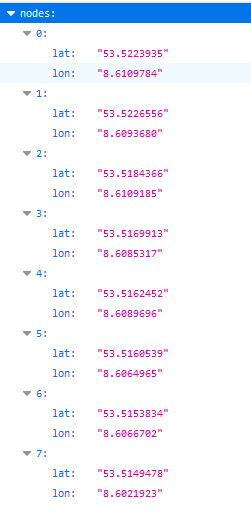
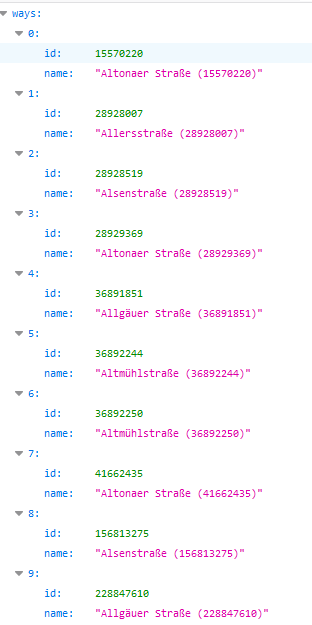

# OSM-Routing-Backend with Python
A WSGI Server to calculate a route based on an OSM-File. 
Used for the backend of an OpenLayers-Visualization. 
Currently it only connects crossing nodes of streets/way, so the sampling of the route isn't that good.

## Install
### Install Python
Download & install Python(>=3.6) -> <a href="https://www.python.org/downloads/">Python Downloads</a>.
### Install Python packages
Run the "INSTALL.bat"  
OR 
run the following command in the project folder:
`pip -R install requirements.txt`
### Download an OSM-File
1. Download an OSM-File of your region. Keep in mind that big OSM-Files can take a long time to process. 
Example download sites: <a>https://download.geofabrik.de/</a>, <a>https://www.openstreetmap.org/export</a>. 
2. Name your OSM-File "map.osm" and override the current "map.osm" in the project folder.
Alternatively you could just change the "osmPath" variable in the "server.py" file.

## Run
### Development Mode
Run the "START.bat"  
OR 
run the following command in the project folder:
`set FLASK_APP=server && flask run -p 5555 --with-threads`
### Production Mode
To run the server in production mode, you must deploy the server correctly on your system.  
<a href="https://flask.palletsprojects.com/en/2.0.x/tutorial/deploy/">Flask Documentation | Deploy</a> 

## Usage
The Server has those following URLs which all respond in a JSON-Format 
<b>If you have any problems try to delete your "map.db" and let the server regenerate it!</b>
### ATTENTION: First Run
When you run the server for the first time and <b>no "map.db" got generated yet</b>, it may take a while before the server starts. 
Thats because the "map.db" has to get generated and this can take a <b>LONG</b> time based on your OSM-File & your computer.

### Get route based on ways 
`http://localhost:5555/getRoute/%fromWay%/%toWay%/`  
<b>fromWay & toWay</b>: AN <a href="https://wiki.openstreetmap.org/wiki/Way">OSM wayID</a>.   
This responses with a JSON-File this following structure:  

### Find ways based on name
`http://localhost:5555/search/%query%/%limit%/` 
<b>query</b>: The street/way name with autocomplete. Example: http://localhost:5555/search/F/%limit%/ -> gives you "Foster Street", "Friday Street" etc.  
<b>limit</b>: The limit of results which should come back.
This responses with a JSON-File this following structure:  

